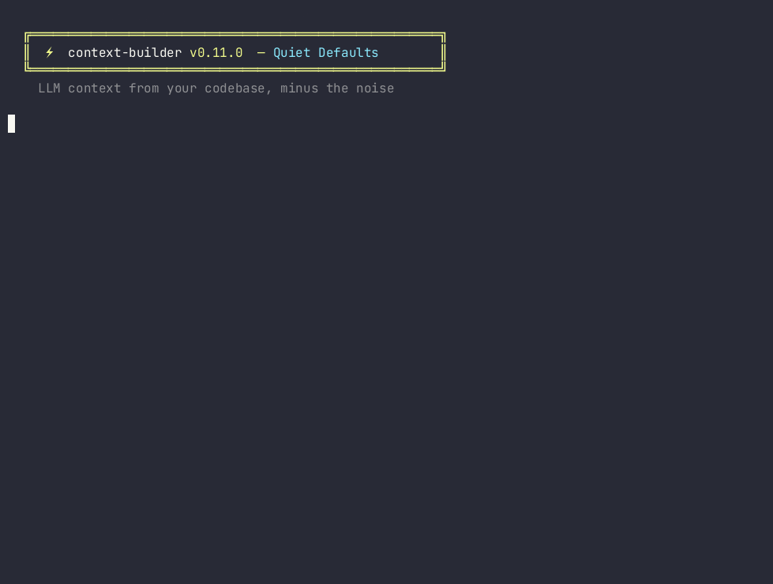

<div align="center">

# Context Builder

A blazing-fast CLI for creating LLM context from your entire codebase.

[](https://crates.io/crates/context-builder)


</div>

<div align="center">

[](https://coveralls.io/github/igorls/context-builder?branch=master)
[](https://github.com/igorls/context-builder/actions/workflows/ci.yml)


</div>

<div align="center">

[](https://github.com/igorls/context-builder/blob/master/LICENSE)

</div>

<br/>

Tired of manually copy-pasting files into your LLM prompts? Context Builder automates this tedious process, creating a single, clean, and context-rich markdown file from any directory.

<div align="center">



</div>

---

## Why Context Builder?

Providing broad context to Large Language Models (LLMs) is key to getting high-quality, relevant responses. This tool was built to solve one problem exceptionally well: **packaging your project's source code into a clean, LLM-friendly format with zero fuss.**

It's a command-line utility that recursively processes directories and creates comprehensive markdown documentation, optimized for AI conversations.

## Core Features


- ⚡ **Blazing Fast & Parallel by Default:**
  Processes thousands of files in seconds by leveraging all available CPU cores.

- 🧠 **Smart & Efficient File Discovery:**
  Respects `.gitignore` and custom ignore patterns out-of-the-box. Ignore files inside the directory apply even when it is not a git checkout; ignore files in parent directories apply only when a `.git` directory or file exists at that directory or an ancestor. Automatically excludes common heavy directories (`node_modules`, `dist`, `build`, `__pycache__`, `.venv`, `vendor`, etc.) at any depth even without a `.git` directory. `target` is excluded only at the directory root, and any directory that contains a `CACHEDIR.TAG` file (such as Cargo's `target/`) is skipped.

- 📊 **Relevance-Based File Ordering:**
  Files appear in LLM-optimized order: config & project docs first, then source code (entry points before helpers), tests, documentation, build/CI files, and lockfiles last. This helps LLMs build a mental model faster.

- 💰 **Context Budgeting (`--max-tokens`):**
  Cap token output to fit your model's context window. When output exceeds about 128K tokens, a non-blocking warning is printed to stderr — nothing is asked.

- 💾 **Memory-Efficient Streaming:**
  Handles massive files with ease by reading and writing line-by-line, keeping memory usage low.

- 🌳 **Clear File Tree Visualization:**
  Generates an easy-to-read directory structure at the top of the output file.

- 🔍 **Powerful Filtering & Preview:**
  Easily include only the file extensions you need and use the instant `--preview` mode to see what will be processed.

 - ⚙️ **Configuration-First:**
  Use a `context-builder.toml` file to store your preferences for consistent, repeatable outputs. Initialize a new config file with `--init`, which will detect the major file types in your project (respecting `.gitignore` patterns) and suggest appropriate filters.

- 🔁 **Automatic Per-File Diffs:**
  When enabled, automatically generates a clean, noise-reduced diff showing what changed between snapshots.

- ✂️ **Diff-Only Mode:**
  Output only the change summary and modified file diffs—no full file bodies—to minimize token usage.

- 🌲 **Tree-Sitter AST Analysis** *(optional)*:
  Extract function/class signatures (`--signatures`), structural summaries (`--structure`), and smart AST-boundary truncation (`--truncate smart`). Supports Rust, JavaScript, TypeScript, Python, Go, Java, C, and C++.

- 🧪 **Accurate Token Counting:**
  Get real tokenizer–based estimates with `--token-count` to plan your prompt budgets.


---

## Installation

### Quick Install (Linux/macOS)

Pre-built binaries include full Tree-Sitter AST support. The installer verifies SHA256 checksums before installing.

```bash
curl -sSL https://raw.githubusercontent.com/igorls/context-builder/master/install.sh | bash
```

> **Note:** piping remote scripts into `sh` is a matter of trust — some scanners flag the `curl | bash` pattern generically. If you prefer, review [install.sh](install.sh) first or use one of the alternatives below.

### Windows (PowerShell)

```powershell
Invoke-WebRequest -Uri "https://github.com/igorls/context-builder/releases/latest/download/context-builder-x86_64-pc-windows-msvc.zip" -OutFile "$env:TEMP\cb.zip"
Expand-Archive "$env:TEMP\cb.zip" -DestinationPath "$env:LOCALAPPDATA\Programs\context-builder" -Force
$env:PATH += ";$env:LOCALAPPDATA\Programs\context-builder"
```

> Add `%LOCALAPPDATA%\Programs\context-builder` to your PATH permanently via System Settings.

### From crates.io

```bash
cargo install context-builder --features tree-sitter-all
```

### From source

```bash
git clone https://github.com/igorls/context-builder.git
cd context-builder
cargo install --path .
```

---

## Usage

### Basic Usage

```bash
# Initialize a new context-builder.toml config file with automatically detected file types (respecting .gitignore)
context-builder --init

# Process current directory and create output.md
context-builder

# Process a specific directory
context-builder -d /path/to/project

# Specify an output file
context-builder -d /path/to/project -o documentation.md
```

### Advanced Options

```bash
# Filter by ripgrep file type, not only an exact extension.
# `toml` also matches Cargo.lock; `md` also matches .markdown and .mdx.
# A leading '.' or '*.' is stripped and the value is lowercased, so
# `-f .rs`, `-f '*.rs'`, and `-f RS` all mean `rs`.
context-builder -f rs -f toml

# Ignore paths or gitignore-style globs.
# Comma-separated values and repeated flags both work.
# A pattern can be a name (docs), a path (crates/core), or a glob (*.lock).
# Quote globs so your shell does not expand them.
context-builder -i docs,assets -i '*.lock' -i crates/core

# Cap output to a token budget (prevents context overflow)
context-builder --max-tokens 100000

# Preview mode (shows the file tree without generating output)
context-builder --preview

# Token count mode (accurately count the total token count of the final document using a real tokenizer.)
context-builder --token-count

# Add line numbers to all code blocks
context-builder --line-numbers

# Opt in to per-file Size and Modified lines (off by default)
context-builder --file-metadata

# Stream the document to stdout and pipe it straight into an LLM tool
context-builder -f rs -o - | llm

# Overwrite an existing output file without asking (`-y` does not gate large runs)
context-builder --yes

# Output only diffs (requires auto-diff & timestamped output)
context-builder --diff-only


# Clear cached project state (resets auto-diff baseline & removes stored state)

context-builder --clear-cache

# Combine multiple options for a powerful workflow
context-builder -d ./src -f rs -f toml -i tests --line-numbers --max-tokens 100000 -o rust_context.md
```

### Default skips (v0.11)

On a full-tree run the tool leaves out three kinds of files and lists each one under a `## Skipped` heading (`path` — `asset`, `too large`, or `secret`). A one-line count is printed to stderr. Secret warnings name the path and a category only — never the file contents.

**Assets.** Images (including SVG), fonts, audio, video, archives, PDFs and office documents, design files (`.ai`, `.psd`, …), compiled objects, wasm, model weights, source maps (`*.map`), and minified bundles (`*.min.js`, `*.min.css`, and the `.mjs` / `.cjs` forms). The extension list lives in `src/content_filter.rs` (`ASSET_EXTENSIONS`).

**Size.** Files strictly larger than **256 KiB** are skipped. `--max-file-size` accepts `256K`, `1M`, `1MB`, `262144` (bytes), and the `KiB` / `MiB` spellings (`K`/`M`/`G` are powers of 1024). **`--max-file-size 0`** disables the limit.

**Secrets.** `id_rsa`, `id_dsa`, `id_ecdsa`, `id_ed25519` (and the `*_sk` names), `*.pem`, `*.key`, `*.p12`, `*.pfx`, `*.ppk`, `credentials*.json`, `.env` and `.env.*` **except** `.env.example` and `.env.sample`, and `.npmrc` / `.pypirc` when they assign a token. `id_rsa.pub` is kept. A placeholder value such as `changeme`, or a value that is wholly an environment reference (`${VAR}`, `$VAR`, `%VAR%`), does not count as a token.

**Escape hatches**

- `--filter svg` (or `png`, `pdf`, `pem`, …) is an allow-list, and naming an excluded extension includes it. `--filter js` likewise includes `*.min.js`. The size limit still applies; raise it or pass `--max-file-size 0` to keep a large file of that type. `--filter json` does **not** opt `credentials*.json` back in.
- `--include-secrets` includes likely-secret files the walk collected. Name-only secrets (`id_rsa`, `credentials.json`, `.env`) are not extensions, so this flag is how you include them. `--filter pem` is enough for `*.pem`.
- **`--hidden`** includes hidden files and directories (`.github/workflows/ci.yml`, `.gitignore`, `.cargo/config.toml`). It does **not** follow symlinks, override `.gitignore` / `--ignore` / the built-in heavy-directory ignores, or descend into `.git`, `.hg`, `.svn`, or `.bzr`. It does **not** include secrets: `.env` stays skipped unless you also pass `--include-secrets`. `.env.example` and `.env.sample` are not secrets, but they are hidden, so they show up only with `--hidden`.

```bash
context-builder --max-file-size 1M          # raise the cap
context-builder --max-file-size 0           # no size cap
context-builder -f svg                      # include SVG files (and nothing else)
context-builder --hidden                    # dotfiles, still no secrets
context-builder --hidden --include-secrets  # also .env, .npmrc, …
```

---

## Configuration

For more complex projects, you can use a `context-builder.toml` file in your project's root directory to store your preferences. This is great for ensuring consistent outputs and avoiding repetitive command-line flags.

### Example `context-builder.toml`

```toml
# Default output file name
output = "context.md"

# Default output folder
output_folder = "docs/context"

# Create timestamped versions of the output file (e.g., context_20250912123000.md)
timestamped_output = true

# Automatically compute per-file diffs against the previous timestamped snapshot
auto_diff = true

# Emit only change summary + modified file diffs (omit full file bodies)
# Set to true to greatly reduce token usage when you just need what's changed.
diff_only = false

# Number of context lines to show around changes in diffs (default: 3)
diff_context_lines = 5

# File types to include (ripgrep types: `toml` also matches Cargo.lock)
filter = ["rs", "toml", "md"]

# Paths or gitignore-style globs to ignore
# (names like "docs", paths like "crates/core", globs like "*.lock")
ignore = ["target", "node_modules", "*.lock", "crates/core"]

# Add line numbers to code blocks
line_numbers = true

# Per-file Size and Modified lines under each file header (off by default).
# They cost tokens and change the document whenever a file's mtime changes.
file_metadata = false

# Preview mode: only show file tree without generating output
preview = false

# Token counting mode
token_count = false

# Tokenizer encoding for --token-count / --max-tokens
# Options: "o200k_base" (GPT-4o / o-series, default) or "cl100k_base" (GPT-4 / GPT-3.5)
encoding = "o200k_base"


# Overwrite an existing output file without asking.
# The >100-file confirmation was removed in v0.11.0; this flag is still accepted.

yes = false


# Encoding handling strategy for non-UTF-8 files

# Options: "detect" (default), "strict", "skip"

encoding_strategy = "detect"

# Skip files larger than this. "256K" (default), "1M", "262144", or "0" (no limit).
# max_file_size = "256K"

# Include hidden dotfiles and directories, except .git / .hg / .svn / .bzr.
# hidden = false

# Include likely-secret files. Dotfile secrets (.env, .npmrc, …) also need hidden = true.
# include_secrets = false

```


 You can initialize a new configuration file using the `--init` command. This will create a `context-builder.toml` file in your current directory with sensible defaults based on the file types detected in your project. The filter suggestions will be automatically tailored to your project's most common file extensions while respecting `.gitignore` patterns and common ignore directories like `target`, `node_modules`, etc. This makes it more likely to include the files you actually want to process.


---

## Auto-diff

When using `timestamped_output = true` together with `auto_diff = true`, Context Builder compares the previous canonical snapshot to the newly generated one and produces:

- A Change Summary (Added / Removed / Modified files)
- A File Differences section containing only modified files (added & removed are summarized but not diffed)

If you also set `diff_only = true` (or pass `--diff-only`), the full “## Files” section is omitted to conserve tokens: you get just the header + tree, the Change Summary, and per-file diffs for modified files.

**Note:** Command-line arguments will always override the settings in the configuration file.

### Command Line Options

- `-d, --input <PATH>` - Directory path to process (default: current directory).
- `-o, --output <FILE>` - Output file path (default: `output.md`). Use `-` to stream the document to **stdout** (e.g. `context-builder -o - | llm`); progress messages then go to stderr so the pipe stays clean.
- `-f, --filter <EXT>` - File types to include (can be used multiple times). These are ripgrep file types, not exact extensions: `toml` also matches `Cargo.lock`, and `md` also matches `.markdown` and `.mdx`. A leading `.` or `*.` is stripped and the value is lowercased (`.rs`, `*.rs`, and `RS` all mean `rs`).
- `-i, --ignore <PATTERN>` - Paths or gitignore-style globs to ignore. Use a comma-separated list (`-i docs,assets`) or repeat the flag (`-i '*.lock' -i crates/core`). A pattern can be a file or directory name (`docs`), a path relative to the project (`crates/core`), or a glob (`*.lock`). Quote globs so the shell does not expand them. Commas always separate patterns on the command line, so a pattern that contains a comma (e.g. `report,old.md`) must go in the `ignore = [...]` list of `context-builder.toml` instead.
- `--max-tokens <N>` - Maximum token budget for the output. Files that exceed the remaining budget are truncated in place (per the `--truncate` mode); further files are omitted with a notice.
- `--preview` - Preview mode: only show the file tree, don't generate output.
- `--token-count` - Token count mode: accurately count the total token count of the final document using a real tokenizer.
- `--line-numbers` - Add line numbers to code blocks in the output.
- `--file-metadata` - Include per-file `- Size:` and `- Modified:` lines under each file header. **Off by default** (breaking change in v0.11.0): those lines cost tokens and change the output whenever a file's modification time changes, even if the bytes did not. Set `file_metadata = true` in `context-builder.toml` for the same effect. An explicit `--file-metadata` overrides `file_metadata = false`.
- `-y, --yes` - Overwrite an existing output file without asking. The confirmation that used to run before processing more than 100 files was removed in v0.11.0; `-y` is still accepted so existing scripts keep working, and it only affects the overwrite prompt.
- `--diff-only` - With auto-diff + timestamped output, output only change summary + modified file diffs (omit full file bodies).
- `--clear-cache` - Remove stored state used for auto-diff; next run becomes a fresh baseline.
- `--signatures` - Replace full file content with extracted function/class signatures *(requires tree-sitter)*.
- `--structure` - Append structural summary (function/class counts) to each file *(requires tree-sitter)*.
- `--truncate <MODE>` - Truncation strategy for `--max-tokens`: `smart` (cut at AST boundaries, default) or `byte` (cut at a UTF-8 character boundary) *(requires tree-sitter)*.
- `--visibility <FILTER>` - Filter extracted signatures by visibility: `all` (default), `public`, or `private`. Honored for Rust, Go, Java, and TypeScript; other languages warn that the filter is not yet applied *(requires tree-sitter)*.
- `--encoding <ENC>` - Tokenizer used for `--token-count` and `--max-tokens`: `o200k_base` (GPT-4o / o-series, default) or `cl100k_base` (GPT-4 / GPT-3.5).
- `--max-file-size <SIZE>` - Skip files strictly larger than SIZE (`256K` default, `1M`, `262144` bytes; `0` disables). See [Default skips](#default-skips-v011).
- `--hidden` - Include hidden dotfiles and directories. Does not enter `.git`/`.hg`/`.svn`/`.bzr`, does not follow symlinks, and does not include likely-secret files.
- `--include-secrets` - Include likely-secret files (`id_rsa`, `*.pem`, `.env`, `credentials*.json`, token-bearing `.npmrc`/`.pypirc`, …). Dotfile secrets also need `--hidden`.
- `--init` - Initialize a new `context-builder.toml` config file.
- `-h, --help` - Show help information.
---

## Token Counting

Context Builder uses the `tiktoken-rs` library to provide accurate token counts. By default it uses the **`o200k_base`** encoding, which matches GPT-4o and the o-series (and is a close approximation for current frontier models). Use `--encoding cl100k_base` for GPT-4 / GPT-3.5. The selected encoding applies to both `--token-count` and `--max-tokens` budgeting.

---

## Documentation

- **[DEVELOPMENT.md](DEVELOPMENT.md):** For contributors. Covers setup, testing, linting, and release process.
- **[BENCHMARKS.md](BENCHMARKS.md):** For performance enthusiasts. Details on running benchmarks and generating datasets.
- **[CHANGELOG.md](CHANGELOG.md):** A complete history of releases and changes.

## Contributing

Contributions are welcome! Please see **[DEVELOPMENT.md](DEVELOPMENT.md)** for setup instructions and guidelines. For major changes, please open an issue first to discuss what you would like to change.

## Changelog

See **[CHANGELOG.md](CHANGELOG.md)** for a complete history of releases and changes.

## License

This project is licensed under the MIT License. See the **[LICENSE](LICENSE)** file for details.
