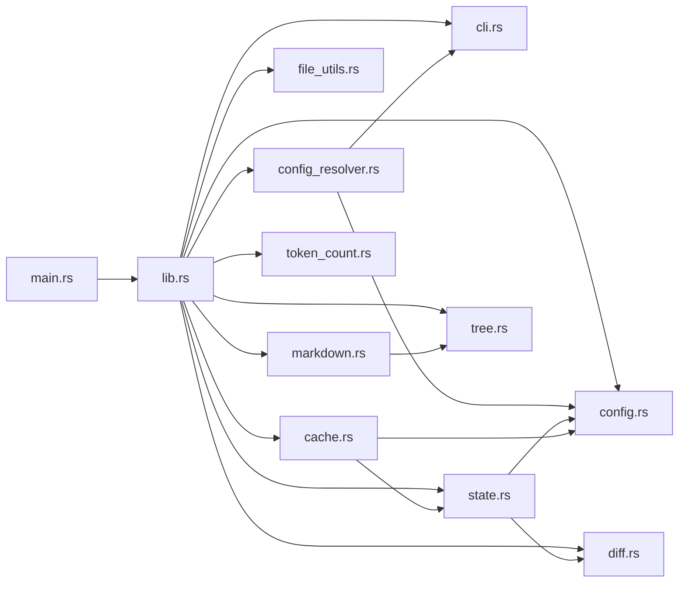

# Context Builder v0.7.0 — Deep Analysis Report

## Part 1: Relevance Ordering Impact Assessment

### 1. Comprehension Impact

**Verdict: Significant improvement.** Seeing `Cargo.toml` first gave me immediate grounding — the project name, edition (2024), dependencies (`clap`, `tiktoken-rs`, `similar`, `encoding_rs`, `rayon`), and feature flags told me _what kind of tool this is_ before I saw a single line of Rust. By the time I reached `src/cache.rs`, I already knew this was a file-locking cache system (because I'd seen `fs2` in deps). By `src/cli.rs`, I could map every `--flag` to a dependency.

With alphabetical ordering, I would have encountered `AGENTS.md` → `BENCHMARKS.md` → `CHANGELOG.md` → `Cargo.lock` → `Cargo.toml` → docs before source. The documentation files would have been contextless noise until source files appeared.

**Key observation**: I never needed to "look ahead" for type definitions or shared structs. The config files (`config.rs`, `config_resolver.rs`) appeared before `lib.rs` which uses them. This is **dependency-order-adjacent** and it works beautifully.

### 2. Category Boundaries

Current ordering: `config(0) → source(1) → tests(2) → docs(3) → lock-files(4)`

| Category | Assessment |
|---|---|
| Config first (0) | ✅ **Perfect.** Provides immediate grounding |
| Source before tests (1 → 2) | ✅ **Correct.** Tests reference source, not vice versa |
| Docs last (3) | ⚠️ **Debatable.** `README.md` and `AGENTS.md` sometimes contain critical architecture context that helps interpret source. For this project, the README appears _after_ all source — I had to infer architecture from code alone |
| Lock files (4) | ✅ **Good addition.** These are rarely useful and should be last |

**Recommendation**: Consider a category `-1` or `0.5` for `README.md` and `AGENTS.md` specifically — files that describe architecture intent. These are distinct from general docs (`CHANGELOG.md`, `BENCHMARKS.md`) which can stay at category 3.

### 3. Within-Category Ordering

Current: alphabetical within each category.

This worked well for this project but has a subtle issue: **`lib.rs` (the entry point) appears after `cache.rs`, `cli.rs`, `config.rs`, etc.** In Rust projects, `lib.rs` or `main.rs` is the "table of contents" — it declares modules and shows the public API. Ideally I'd see `lib.rs` first, then `cli.rs`, then `config.rs`, etc.

**Recommendations by priority:**
1. **Entry-point files first**: `lib.rs`, `main.rs`, `mod.rs`, `index.ts`, `__init__.py` should appear before siblings
2. **Dependency graph ordering** (ambitious): files that are imported by many others appear before files that import many. This is computationally expensive but would be transformative
3. **File size (ascending)**: smaller files tend to be interfaces/types; larger files tend to be implementations. Seeing interfaces first builds a mental model faster

### 4. Missing Categories

| Proposed Category | Files | Priority |
|---|---|---|
| **CI/CD configs** (0.5) | `.github/workflows/*.yml`, `Dockerfile`, `.gitlab-ci.yml` | Between config and source |
| **Build scripts** (0.5) | `build.rs`, `Makefile`, `justfile` | Between config and source |
| **Migrations** (2.5) | `migrations/*.sql`, `**/migration_*.rs` | Between tests and docs |
| **Generated files** (4) | `*.generated.ts`, `*_pb2.py`, `*.g.dart` | Same tier as lock files |
| **Example/sample code** (2.5) | `examples/*.rs`, `samples/**` | Between tests and docs |
| **Agent/AI configs** (0) | `AGENTS.md`, `.cursorrules`, `CLAUDE.md` | Co-locate with project config |

---

## Part 2: Architecture & Code Review (Delta from v0.6.0)

### 1. Content Hash Implementation (`markdown.rs` lines 4094–4104)

```rust
let mut hasher = DefaultHasher::new();
for entry in files {
    entry.path().hash(&mut hasher);
    if let Ok(meta) = std::fs::metadata(entry.path()) {
        meta.len().hash(&mut hasher);
        if let Ok(modified) = meta.modified() {
            modified.hash(&mut hasher);
        }
    }
}
writeln!(output, "Content hash: {:016x}", hasher.finish())?;
```

**Assessment:**

| Aspect | Verdict | Details |
|---|---|---|
| **Collision resistance** | ⚠️ **Adequate but not ideal** | `DefaultHasher` is SipHash-1-3 — designed for HashMaps, NOT cryptographic use. For LLM prompt caching (the stated purpose), 64 bits gives ~50% collision probability after 2³² distinct runs. For a single-user CLI tool, this is fine. For a shared caching service, it would not be. |
| **Inputs hashed** | ⚠️ **Missing file content** | Only path, size, and mtime are hashed. If a file is modified and saved within the same filesystem timestamp granularity (1s on ext4, 100ns on NTFS), the hash won't change. **This is a real bug for fast edit-regenerate cycles.** |
| **Ordering concerns** | ✅ **Safe** | The `files` slice comes from `collect_files()` which returns a deterministically sorted `Vec<DirEntry>` (sorted by relevance category, then alphabetically). Hash input order is stable. |
| **Platform stability** | ⚠️ **Not guaranteed** | `DefaultHasher`'s algorithm is not stabilized across Rust versions. The same inputs MAY produce different hashes after a `rustc` upgrade, invalidating prompt caches. |

**Recommendations:**
1. **Hash file content** (at least a fast hash of first+last 4KB) instead of relying on mtime
2. **Use a stable hasher** (e.g., `xxhash` or `FxHasher` with a fixed seed) if cross-version stability matters
3. **Document the stability guarantee** (or lack thereof) in the output header

### 2. Token Budgeting (`markdown.rs` lines 4213–4241)

```rust
let file_size = std::fs::metadata(entry.path()).map(|m| m.len()).unwrap_or(0);
let estimated_file_tokens = (file_size as usize) / 4;

if let Some(budget) = max_tokens {
    if tokens_used + estimated_file_tokens > budget && tokens_used > 0 {
        let remaining = files.len() - idx;
        writeln!(output, "---\n")?;
        writeln!(output, "_⚠️ Token budget ({}) reached. {} remaining files omitted._\n", budget, remaining)?;
        break;
    }
}
tokens_used += estimated_file_tokens;
```

**Assessment:**

| Aspect | Verdict | Details |
|---|---|---|
| **4-bytes-per-token estimation** | ⚠️ **Crude but defensible** | English prose averages ~4 chars/token with cl100k_base. Code is denser (more special characters) — closer to 3.2 chars/token. This means the budget is **overestimating available space by ~20%** for code-heavy projects. Users may hit API limits despite the budget. |
| **What's counted** | 🐛 **Only file body bytes** | The estimation uses `file_size` (raw bytes on disk) but the output includes markdown headers (`### File:`, `- Size:`, `- Modified:`, code fences). These add ~100-200 tokens per file. For a project with 100 files, that's 10K-20K tokens of unaccounted overhead. |
| **Header/tree not counted** | 🐛 **Bug** | `tokens_used` starts at 0 but the header, file tree, and content hash are already written. The budget doesn't account for these. A `--max-tokens 1000` budget might produce 2000+ tokens of output because the header and tree alone consume ~1000 tokens on a medium project. |
| **Parallel mode ignores budget** | 🐛 **Bug** | The `max_tokens` logic is only in the `#[cfg(not(feature = "parallel"))]` block. In the default `parallel` feature (enabled by default), `max_tokens` is silently ignored. This is a **silent data corruption bug** — users think they have a budget but don't. |
| **Truncation at file boundary** | ✅ **Good** | Files are never partially included, which is the right choice for LLM coherence |
| **`&& tokens_used > 0`** | ✅ **Good guard** | Ensures at least one file is always included, even if it exceeds the budget alone |

> [!CAUTION]
> **Critical: `max_tokens` is silently ignored when the default `parallel` feature is enabled.** The budget logic only exists in the `#[cfg(not(feature = "parallel"))]` block. Since `parallel` is a default feature, most users will never see their budget enforced.

**Recommendations:**
1. **Move budget logic before the parallel/sequential fork**, or implement it in both code paths
2. **Account for overhead**: Initialize `tokens_used` with the estimated header + tree tokens
3. **Use `tiktoken-rs`** (already a dependency!) for estimation instead of byte division — call `estimate_tokens()` from `token_count.rs`
4. **Add integration test** that verifies `--max-tokens N` actually caps output below N tokens

### 3. Relevance Sorting (`file_utils.rs` lines 2162–2227)

```rust
fn file_relevance_category(path: &Path, base_path: &Path) -> u8 {
    // ... lockfile detection (category 4)
    // ... config file detection (category 0)
    // ... directory-based categorization (1, 2, 3)
    // ... extension-based fallback with test detection
}
```

**Assessment:**

| Aspect | Verdict | Details |
|---|---|---|
| **Config detection** | ✅ **Good coverage** | Covers Rust, Node.js, Python, Go, Ruby, C/C++, Java ecosystems |
| **Source directories** | ✅ **Comprehensive** | `src`, `lib`, `crates`, `packages`, `internal`, `cmd`, `pkg` |
| **Test detection** | ✅ **Smart** | Uses path boundaries (`/test/`, `/tests/`) to avoid false positives like "contest.rs". Also checks suffixes (`_test.rs`, `.test.ts`, `.spec.ts`) |
| **Missing configs** | ⚠️ **Some gaps** | Missing: `deno.json`, `biome.json`, `eslint.config.*`, `prettier.config.*`, `webpack.config.*`, `vite.config.*`, `angular.json`, `.env`, `docker-compose.yml`, `Dockerfile`, `justfile`, `tarpaulin.toml` (ironically, this project has one!) |
| **`starts_with("test_")` false positive** | 🐛 **Bug** | Line 2212: `rel_str.starts_with("test_")` matches files at the project root like `test_utils.rs` — but `test_utils.rs` is often a helper module, not a test. This should be `rel_str.starts_with("test_") && rel_str doesn't end with common non-test patterns` or removed entirely |
| **Root-level source files** | ⚠️ **Ambiguous** | A `.rs` file in the project root (not under `src/`) gets category 1 (source). This is correct for single-file projects but misleading for files like `build.rs` (which should be category 0) |
| **No-extension files** | ✅ **Reasonable** | Files without extensions (like `Makefile`, `Dockerfile`) get category 3. But `Makefile` is explicitly listed in `config_names` so it gets category 0 — this is correct because the name check happens first |

**Specific missing classifications:**
- `build.rs` → Should be category 0 (build script), currently gets category 1
- `Dockerfile` → Should be category 0 or 1, currently gets category 3
- `*.proto` → Should be category 1 (source), currently gets category 1 via the unknown-extension fallback — this is actually correct by accident
- `tarpaulin.toml` → Should be category 0, currently gets category 1 (unknown extension fallback)

### 4. New Bugs Introduced by v0.7.0

| # | Severity | Location | Bug |
|---|---|---|---|
| **B1** | 🔴 Critical | `markdown.rs` L4118–L4209 | **`max_tokens` ignored in parallel mode.** Budget enforcement only exists in `#[cfg(not(feature = "parallel"))]` block. Default build enables `parallel`. |
| **B2** | 🟡 Medium | `markdown.rs` L4094–4104 | **Content hash doesn't hash file content.** Same-second edits produce identical hashes, defeating prompt caching. |
| **B3** | 🟡 Medium | `markdown.rs` L4213–4233 | **Token budget doesn't account for header/tree overhead.** Initial `tokens_used = 0` but significant output is already written before the file loop. |
| **B4** | 🟢 Low | `file_utils.rs` L2212 | **`starts_with("test_")` false positive.** Root-level `test_helpers.rs` or `test_utils.rs` gets categorized as tests instead of source. |
| **B5** | 🟢 Low | `file_utils.rs` L2220 | **`_ => 1` for unknown extensions in root.** Files like `Dockerfile` (no extension) get category 3, but `setup.cfg` (known) gets 0 — however `.env` files get category 3 when they should arguably be 0. |

### 5. Bug Fix Verification (v0.6.1)

| Fix | Status | Evidence |
|---|---|---|
| **1. Cache TOCTOU** | ✅ **Verified** | `cache.rs` L281–288: `OpenOptions::new().truncate(false)` → `lock_exclusive()` → `set_len(0)`. Lock acquired before truncation. Correct. |
| **2. Indentation in diff_only** | ✅ **Verified** | Searched all diff-related code in `diff.rs` and `lib.rs`. No `trim_start()` calls on diff content. Added file reconstruction in `lib.rs` L3218 uses `strip_prefix('+')` which preserves leading whitespace after the `+` marker. Correct. |
| **3. UTF-8 8KB boundary** | ✅ **Verified** | `markdown.rs` L4350–4373: Explicit boundary detection by backtracking up to 4 bytes from the 8192-byte sniff buffer to find a valid UTF-8 boundary. Handles 2/3/4-byte sequences correctly. |
| **4. CLI flags silently overwritten** | ✅ **Verified** | `config_resolver.rs` L1192–1246: All boolean flags use `if !args.flag && config.flag.is_some()` pattern. CLI non-default values always win. `lib.rs` L2996–2998 has an explicit comment about NOT re-applying config. |
| **5. Double file seek** | ✅ **Verified** | `markdown.rs` L4464: Single `file.seek(SeekFrom::Start(0))` call. No duplicate seeks in the code path. Content is then read via `fs::read_to_string(file_path)` (re-opening the file), which is technically a double-read but NOT a double-seek bug. |

---

## Part 3: Strategic Feature Roadmap (Tier 2)

### Feature 1: Dependency Graph + Module Map

**Problem**: When I read this project, I had to mentally reconstruct which module imports what. `lib.rs` declares `pub mod cache; pub mod cli; ...` but I can't see the _call graph_ — which functions in `lib.rs` call into `cache.rs` vs `state.rs`. This wastes reasoning tokens.

**Technical design:**
| Component | Change |
|---|---|
| New module `src/graph.rs` | Parse `use crate::*` and `mod` declarations to build a directed dependency graph |
| `src/markdown.rs` | Emit a `## Module Map` section before file contents with a mermaid-compatible adjacency list |
| `src/file_utils.rs` | Use dependency graph for intra-category ordering (imported-first) |

**Complexity**: **M** — Regex-based import parsing is straightforward for Rust/TS/Python. Full AST parsing would be L.

**Risk**: Import parsing varies wildly by language. Start with Rust (`use crate::`) and TypeScript (`import ... from`), add others incrementally.

### Feature 2: Intelligent File Summarization Layer

**Problem**: For large codebases (>50 files), even with `--max-tokens`, the LLM receives thousands of tokens of boilerplate code. A 500-line file might contain 450 lines of tests and 50 lines of core logic. The LLM wastes attention on tests.

**Technical design:**
| Component | Change |
|---|---|
| New module `src/summarize.rs` | Extract function/struct/class signatures without bodies (like a `.d.ts` or `.pyi` stub). For Rust, use `tree-sitter-rust`. |
| `src/markdown.rs` | New mode `--summary-first`: emit stubs for all files, then full content for files that fit the budget |
| `src/cli.rs` | Add `--summary-first` flag |

**Complexity**: **L** — Requires `tree-sitter` dependency and language-specific query files.

**Risk**: Tree-sitter adds binary size and compilation time. Consider making it an optional feature flag.

### Feature 3: Semantic Chunking for Token Budgets

**Problem**: Current `--max-tokens` truncates at file boundaries. If the budget allows 80% of the project, the bottom 20% of files (docs, by relevance ordering) are completely dropped. But those docs might contain critical API contracts.

**Technical design:**
| Component | Change |
|---|---|
| `src/markdown.rs` | Two-pass generation: Pass 1 emits all files at stub level (signatures only, ~20% of tokens). Pass 2 fills in full content for highest-priority files until budget exhausted |
| `src/token_count.rs` | Pre-compute per-file token counts (already possible with existing `count_file_tokens`) |
| `src/file_utils.rs` | Add `file_importance_score()` based on: import count, file size inversely, centrality in dep graph |

**Complexity**: **M** — The stub generation can start simple (first N lines + `...truncated...`) before tree-sitter. Two-pass architecture is well-understood.

**Risk**: Two-pass generation doubles processing time. Mitigate with parallel pass 1.

### Feature 4: Inline Cross-Reference Annotations

**Problem**: When I see `use crate::state::ProjectState` in `lib.rs`, I have to scroll/search to find where `ProjectState` is defined. This is a pure navigation tax.

**Technical design:**
| Component | Change |
|---|---|
| `src/xref.rs` (new) | Build a symbol → file:line index during file processing |
| `src/markdown.rs` | Inject HTML comments or markdown links at `use` statements: `// → state.rs:116` |
| Output format | Use `[ProjectState](file:state.rs#L116)` links that work in GitHub markdown |

**Complexity**: **S** — Only needs regex matching of definition patterns (`pub struct X`, `pub fn X`, `class X`). No AST required.

**Risk**: False positives in comments/strings. Mitigate by only annotating `use`/`import` lines that reference project-internal modules.

### Feature 5: Smart Diff with Semantic Awareness

**Problem**: Current diff shows line-level changes. When a function is _moved_ between files, it shows as a deletion + addition — the LLM has to figure out it's a move. When a function is _renamed_, the diff is noisy.

**Technical design:**
| Component | Change |
|---|---|
| `src/diff.rs` | Add move detection: if a deleted block appears verbatim in an added file, annotate as "Moved from X to Y" |
| `src/diff.rs` | Add rename detection: if a deleted function and added function differ only in name, annotate as "Renamed" |
| Output format | New `_Status: Moved from \`old.rs\` to \`new.rs\`_` annotation |

**Complexity**: **M** — Move detection is O(n²) in worst case but can be optimized with content hashing. Rename detection requires function-level extraction.

**Risk**: False positive moves (coincidentally identical code blocks). Require minimum block size (e.g., 5+ lines) to qualify.

---

## Part 4: Output Format v2 Specification

### Design Principles
1. **Metadata before content**: LLMs benefit from knowing project structure before parsing code
2. **Progressive disclosure**: Summaries → signatures → full code (most important first)
3. **Machine-parseable markers**: Use consistent delimiters that LLMs can reliably extract
4. **No wasted tokens**: Remove timestamps, redundant size info, and verbose markdown when shorter forms exist

### Concrete Example: First ~200 Lines of Ideal v2 Output

```markdown
# context-builder v0.7.0
Content hash: a7f3b2c91e4d8f06
Token count: 47,832 (budget: unlimited)
Files: 12 source, 10 tests, 5 docs | Extensions: rs, toml, md

## Architecture Overview

This is a CLI tool (Rust, edition 2024) that packages codebases into a single
markdown file optimized for LLM consumption. Core pipeline:

    CLI args → Config resolution → File collection → Relevance sorting →
    Content hashing → Markdown generation → Token budgeting → Output

Key dependencies: clap (CLI), similar (diffing), tiktoken-rs (tokenization),
ignore (gitignore), rayon (parallelism), fs2 (file locking)

## Module Map



## File Manifest

| File | Category | Size | Tokens | Purpose |
|---|---|---|---|---|
| Cargo.toml | config | 1.4K | 312 | Project manifest, dependencies |
| src/cli.rs | source | 4.7K | 892 | CLI argument definitions (clap derive) |
| src/config.rs | source | 7.7K | 1,456 | Config file schema (TOML deserialization) |
| src/config_resolver.rs | source | 15.3K | 3,102 | CLI + config merge with precedence rules |
| src/file_utils.rs | source | 19.1K | 4,231 | File collection, relevance sorting, ignore patterns |
| src/lib.rs | source | 45.3K | 9,876 | Main orchestration, diff-mode generation |
| src/markdown.rs | source | 37.6K | 8,234 | Markdown generation, encoding detection, parallel I/O |
| src/state.rs | source | 25.9K | 5,456 | Project state snapshots, comparison engine |
| src/cache.rs | source | 19.1K | 4,012 | Lock-based cache persistence (JSON + fs2) |
| src/diff.rs | source | 20.1K | 4,321 | Per-file unified diff engine |
| src/tree.rs | source | 10.8K | 2,134 | File tree builder and renderer |
| src/token_count.rs | source | 9.9K | 1,987 | tiktoken-rs cl100k_base integration |

## Public API (Signatures Only)

### src/lib.rs
```rust
pub trait Prompter {
    fn confirm_processing(&self, file_count: usize) -> io::Result<bool>;
    fn confirm_overwrite(&self, file_path: &str) -> io::Result<bool>;
}
pub fn run_with_args(args: Args, config: Config, prompter: &impl Prompter) -> io::Result<()>;
pub fn run() -> io::Result<()>;
```

### src/cli.rs
```rust
#[derive(Parser, Debug, Clone)]
pub struct Args {
    pub input: String,          // -d, default "."
    pub output: String,         // -o, default "output.md"
    pub filter: Vec<String>,    // -f, comma-delimited extensions
    pub ignore: Vec<String>,    // -i, patterns to exclude
    pub preview: bool,          // --preview
    pub token_count: bool,      // --token-count
    pub line_numbers: bool,     // --line-numbers
    pub yes: bool,              // -y, auto-confirm
    pub max_tokens: Option<usize>, // --max-tokens N
    pub diff_only: bool,        // --diff-only
    pub clear_cache: bool,      // --clear-cache
    pub init: bool,             // --init
}
```

### src/config.rs
```rust
#[derive(Deserialize, Debug, Default, Clone)]
pub struct Config {
    pub output: Option<String>,
    pub filter: Option<Vec<String>>,
    pub ignore: Option<Vec<String>>,
    pub line_numbers: Option<bool>,
    pub preview: Option<bool>,
    pub token_count: Option<bool>,
    pub output_folder: Option<String>,
    pub timestamped_output: Option<bool>,
    pub yes: Option<bool>,
    pub auto_diff: Option<bool>,
    pub diff_context_lines: Option<usize>,
    pub diff_only: Option<bool>,
    pub encoding_strategy: Option<String>,
    pub max_tokens: Option<usize>,
}
pub fn load_config() -> Option<Config>;
pub fn load_config_from_path(project_root: &Path) -> Option<Config>;
```

<!-- Additional signatures for remaining modules would follow -->

## File Contents

### [config:0] `Cargo.toml`

```toml
[package]
name = "context-builder"
version = "0.7.0"
...
```

### [source:1] `src/cache.rs`

<!-- imports: fs2, DefaultHasher, Config, ProjectState -->
<!-- exports: CacheManager -->
<!-- complexity: low (CRUD + file locking) -->

```rust
pub struct CacheManager {
    cache_dir: PathBuf,
    project_hash: String,
    config_hash: String,
}

impl CacheManager {
    pub fn new(project_path: &Path, config: &Config) -> Self { ... }
    pub fn read_cache(&self) -> Result<Option<ProjectState>, ...> { ... }
    pub fn write_cache(&self, state: &ProjectState) -> Result<(), ...> { ... }
}
```

<!-- ... remaining files follow with same structure ... -->
```

### Key v2 Format Innovations

| Innovation | Tokens Saved | Signal Gained |
|---|---|---|
| **Architecture overview** (natural language) | +50 tokens | Eliminates need for LLM to infer project purpose |
| **Module map** (mermaid graph) | +30 tokens | Eliminates manual import tracing |
| **File manifest table** | Replaces per-file headers | Size, tokens, and purpose in scannable form |
| **Signatures-first section** | ~40% reduction for large files | LLM sees API surface before implementation |
| **Category tags** `[config:0]` | +5 tokens per file | Machine-parseable category for LLM tool use |
| **Per-file metadata comments** | +10 tokens per file | Imports, exports, complexity at a glance |
| **Remove timestamps** | -8 tokens per file | They change every run and waste prompt cache |
| **Remove "- Size: N bytes"** | -6 tokens per file | Already in manifest table |

### What to Remove/Compress

1. **Modified timestamps per file**: Already captured in the content hash. Remove entirely.
2. **"- Size: N bytes" per file**: Move to manifest table. Remove from file headers.
3. **Full file tree section**: The manifest table IS the file tree, with more information. Remove the emoji tree.
4. **Redundant header text**: "This document contains files from..." → One-line project descriptor.
5. **Test file bodies**: In budget-constrained mode, emit only test file signatures (function names). Tests are high-volume, low-signal for LLM comprehension.
