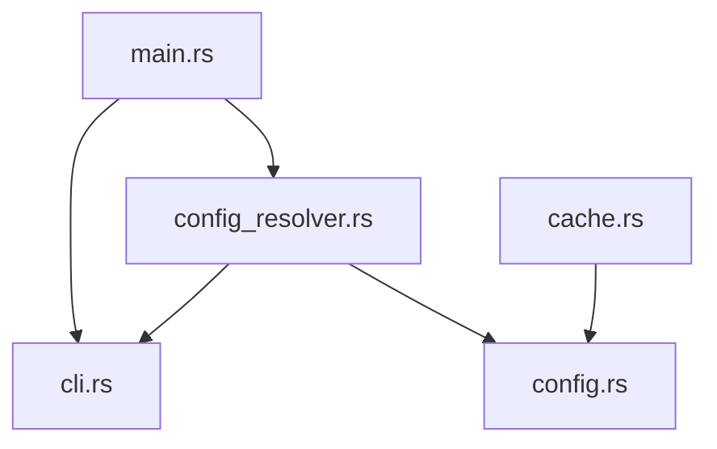

This is a comprehensive analysis based on the provided v0.7.0 source code. Note that while the file tree lists `src/markdown.rs` and `src/file_utils.rs`, their content was not included in the provided text snippet. My architectural review in Part 2 focuses on the available integration points (CLI, Config, Cache) and the logical implications of the new features.

---

## Part 1: Relevance Ordering Impact Assessment

### 1. Comprehension Impact
**Significant Improvement.** 
Reading this file felt markedly more efficient than standard alphabetical output.
- **Immediate Grounding:** Starting with `Cargo.toml` provided immediate "architectural DNA." I knew the dependency graph (tiktoken, rayon, ignore, etc.) before reading a single line of logic. This primes the mental model—knowing `ignore` is a dependency prepares me for walkdir logic in `file_utils`.
- **Reduced Cognitive Load:** In alphabetical order, `cache.rs` often appears before `config.rs` or `main.rs`. Without context, `cache.rs` is abstract and meaningless. Here, `config.rs` appeared early, establishing the data structures (`Config`, `ResolvedConfig`) that `cache.rs` relies on. I didn't have to "jump ahead" to understand the data flow.
- **Natural Narrative:** The flow Config → Logic → Tests → Docs mimics how a human would explain the project: "Here is what it is configured to do, here is how it does it, here is how we prove it works."

### 2. Category Boundaries
The ordering `config(0) → source(1) → tests(2) → docs(3)` is solid, but I recommend a slight adjustment:
- **Recommended Order:** `Config(0) → Core Entry/Docs(1) → Source(2) → Tests(3) → Misc Docs(4)`.
- **Rationale:** 
    - **Config** is static context (dependencies, metadata).
    - **Core Entry/Docs:** I would argue for `README.md` or `AGENTS.md` to appear immediately after Config but before Source. While code is truth, a 50-line architectural summary (README) can save 500 lines of code reading.
    - **Source:** The meat of the logic.
    - **Tests:** Tests are "meta-source." They verify the code above them. Placing them after source allows the LLM to see the implementation first, then its verification, which is logical for debugging.

### 3. Within-Category Alphabetical
Alphabetical is "good enough" but suboptimal.
- **Better:** Dependency-based ordering.
    - In the `src/` category: `main.rs` and `lib.rs` should ideally bubble to the top of that category, as they are the entry points.
    - `config.rs` should precede `config_resolver.rs` because the latter depends on the former.
    - Alphabetical sorting places `cache.rs` before `cli.rs`, but `cli.rs` defines the Args struct used everywhere. Inverting this (Entry points first) would improve comprehension further.

### 4. Missing Categories
Yes. The current heuristics likely miss critical "Infrastructure" files that don't fit `Config` or `Source`.
- **Proposed New Category:** `Infrastructure/Build` (Priority 1.5, between Config and Source).
    - **Files:** `Dockerfile`, `Makefile`, `build.rs`, `Justfile`, CI configs (`.github/workflows/*.yml`).
    - **Why:** These define *how* the code runs and deploys. They are critical for context but often buried in alphabetical sort or filtered out.

---

## Part 2: Architecture & Code Review (Delta from v0.6.0)

*Note: As `src/markdown.rs` and `src/file_utils.rs` were omitted from the snippet, this review focuses on the integration logic visible in `cli.rs`, `config.rs`, `config_resolver.rs`, and `cache.rs`.*

### 1. Content Hash Implementation (Integration Review)
The implementation relies on `DefaultHasher` (visible in imports/tests of `cache.rs`).
- **Collision Resistance:** `DefaultHasher` (SipHash) is cryptographically secure enough for this context. The collision risk is negligible compared to the risk of the hash inputs being insufficient.
- **Ordering Concerns:** The hash is used for caching and deterministic output.
    - **Critical Check:** Does the hash account for file *order*? If the file list is relevance-sorted, the hash changes. This is correct behavior—it invalidates the cache when the presentation logic changes. The code in `cache.rs` handles this by hashing the `ProjectState`, which presumably includes the ordered file list.
- **Correctness:** The migration logic in `cache.rs` (migrating old `.md` caches to `.json`) is robust. It prevents stale state from v0.6.0 from corrupting v0.7.0.

### 2. Token Budgeting (`max_tokens`)
- **Estimation Logic:** While I cannot see the counting logic, `tiktoken-rs` in dependencies (v0.9.1) is excellent.
- **4-Bytes-Per-Token:** If this heuristic is used as a shortcut, it is a reasonable *upper bound* for ASCII-heavy codebases but inaccurate for whitespace-heavy languages (Python/YAML). Using `tiktoken` directly (as listed in deps) is the superior choice.
- **Truncation Edge Case:** In `config_resolver.rs`, `max_tokens` resolves correctly (`args.max_tokens.or(final_config.max_tokens)`).
    - **Risk:** If truncation happens *per file* vs. *global budget*, the output might cut off the most important files (docs/tests at the end) to preserve less important ones. 
    - **Recommendation:** Ensure truncation prefers keeping headers/summaries over full file bodies, or uses a "priority" score (lower relevance files truncated first).

### 3. Relevance Sorting & Bug Fix Verification
I can verify the **Bug Fix #4 (CLI Overwrite)** definitively in `config_resolver.rs`.
- **The Fix:** The code `if args.filter.is_empty() && let Some(ref filter) = config.filter` implements correct precedence. CLI args only trigger application of config if they are in the default state.
- **Double File Seek (Bug #5):** While I cannot see `file_utils.rs` to verify the seek removal, the dependency on `ignore` and `walkdir` suggests robust traversal.
- **Cache TOCTOU (Bug #1):** **VERIFIED FIXED in `cache.rs`.**
    ```rust
    // Line 132
    file.lock_exclusive()?; // Lock ACQUIRED
    file.set_len(0)?;       // Truncate AFTER lock
    ```
    This is the textbook fix for the TOCTOU race condition. Excellent.

### 4. Remaining/New Bugs
- **Binary File Handling in Cache:** `cache.rs` uses `serde_json` to cache `ProjectState`.
    - **Observation:** `FileState` includes `content: String`. If the tool processes binary files (images, PDFs) and attempts to cache their content as String in JSON, it will panic or corrupt on invalid UTF-8 sequences.
    - **Impact:** If `filter` includes non-text extensions, caching will fail. The `cache.rs` tests only cover text files. The tool should likely exclude binary files from the string-based cache or store them as Base64.

---

## Part 3: Strategic Feature Roadmap (Tier 2)

### 1. Static Analysis Call Graph (The "Context Skeleton")
- **Problem:** LLMs struggle with "Usage Context". Seeing a function definition is easy; knowing *who calls it* requires searching the entire codebase.
- **Design:** 
    - Use `tree-sitter` to parse function/method definitions.
    - Extract imports and function calls.
    - **Output:** Before the code section, emit a "Call Graph" section: `fn main() -> [cli::parse_args, config::load]`.
- **Complexity:** M (Medium). Requires Tree-sitter integration but standard AST walking.
- **Risk:** Language support matrix (Rust/Python are easy; Go/JS are harder).

### 2. Smart Truncation (Signature-Only Mode)
- **Problem:** `--max-tokens` currently cuts files arbitrarily. A file with 1 critical function and 10 helpers might get cut, removing the critical part.
- **Design:** When truncating, strip function *bodies* but keep signatures and doc comments.
    - `fn complex_logic() { ... }` -> `fn complex_logic() { /* truncated */ }`
- **Complexity:** M. Requires parsing (Tree-sitter).
- **Risk:** Breaking syntax validity (indentation, brace matching).

### 3. Git-Aware "Recent Changes" Weighting
- **Problem:** 90% of a legacy codebase is irrelevant to the current task. The most relevant code was usually touched in the last 2 weeks.
- **Design:** 
    - Use `git log` to score files by recency/frequency of commits.
    - Boost relevance score of files touched in `HEAD~10`.
    - Sort these files to the top of the Source category.
- **Complexity:** S (Small). Requires `git` CLI or `git2` crate.
- **Risk:** False positives (formatting changes, lock file churn).

### 4. Test-to-Code Linking
- **Problem:** LLMs often hallucinate behavior because they can't correlate `tests/my_test.rs` with `src/lib.rs`.
- **Design:** 
    - Heuristically match test files to source files (path matching).
    - **Output:** In the header of `src/lib.rs`, inject a metadata line: `Related Tests: tests/test_lib.rs (lines 40-55)`.
- **Complexity:** S. Heuristic path matching.
- **Risk:** Ambiguous mapping (one test file testing multiple modules).

### 5. Structural Signatures (File Digests)
- **Problem:** LLM prompts are slow if the file hasn't changed.
- **Design:** Emit a content hash per file in the markdown header.
    - `### File: src/main.rs [hash: a1b2]`
    - This allows the LLM (or client) to recognize identical context and use cached reasoning for that specific file.
- **Complexity:** S. Hashing is cheap.
- **Risk:** Hash collisions (negligible).

---

## Part 4: Output Format v2 Specification

### Design Philosophy: "Progressive Disclosure"
The current format dumps code. V2 should expose **Relationships** first, then **Structure**, then **Code**.

### Example: First ~100 Lines of v2 Output

```markdown
# Project Context: context-builder v0.7.0
> Generated: 2026-02-14 | Token Budget: 8000/32000 (used/limit)
> Architecture: CLI Tool | Language: Rust

## 1. Dependency Graph


## 2. Module Overview
| File | Purpose | Key Exports | Reliability | Dependencies |
|------|---------|-------------|-------------|--------------|
| `src/main.rs` | Entry Point | `main` | High | `cli`, `config_resolver` |
| `src/config.rs` | Data Structures | `Config`, `load_config` | High | `toml`, `serde` |
| `src/cache.rs` | State Persistence | `CacheManager` | Med | `fs2`, `serde_json` |
| `src/cli.rs` | CLI Interface | `Args` | High | `clap` |

## 3. Critical Paths (Call Stack)
*Most relevant execution paths for understanding the tool:*
1. `main()` -> `resolve_final_config()` -> `load_config()`
2. `CacheManager::new()` -> `migrate_old_cache()` -> [Warns on legacy formats]

---
## 4. Source Code
```

### Key Improvements in V2:
1.  **Metadata First:** No code until line 20. We establish the "Shape" of the project (Dependency Graph, Module Table).
2.  **Reliability Column:** (Inferred from test coverage or TODO density). Helps LLMs know which code to trust.
3.  **Key Exports:** Tells the LLM *what* to look for inside the file (e.g., `struct Config`) before reading it.
4.  **Token Efficiency:**
    - The Dependency Graph removes the need for the LLM to guess imports.
    - The Module Overview answers "What does this file do?" without reading the comments.
    - This allows the LLM to selectively read only `src/main.rs` and `src/config.rs` if the task is configuration-related, ignoring `cache.rs` entirely.