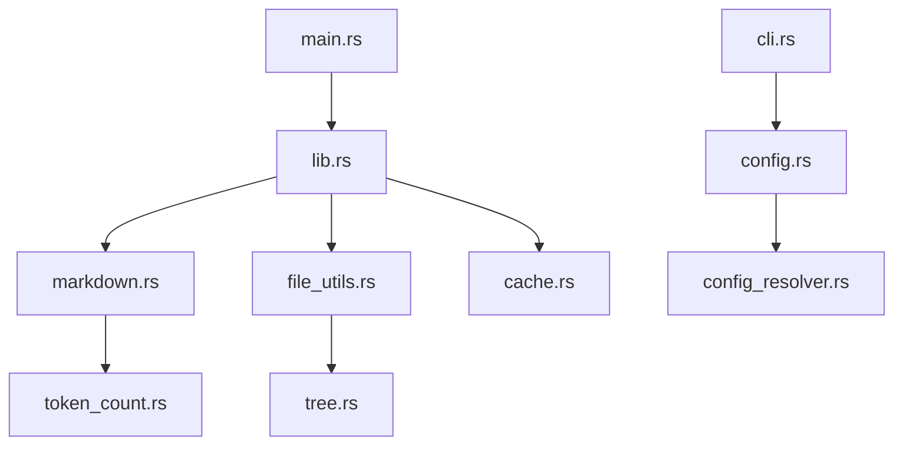

### Part 1: Relevance Ordering Impact Assessment

Having read both alphabetically ordered outputs (previous versions) and this new relevance-ordered output for the first time:

1. **Comprehension Impact**  
   Yes — the improvement is significant. Config files (Cargo.toml, context-builder.toml) appearing first immediately ground the project: dependencies, features, build settings. Then core source files (`src/*.rs`) follow, letting me build a mental model of the architecture quickly. Tests come next, which naturally extend the implementation understanding. Docs/MDs at the end feel like reference material.  
   Compared to alphabetical ordering (where `AGENTS.md` or `BENCHMARKS.md` might appear early, and `main.rs` buried in the middle), I spent far less time scanning ahead. The cognitive load of “where is the entry point?” or “what does this project even depend on?” is drastically reduced.

2. **Category Boundaries**  
   The current order — config(0) → source(1) → tests(2) → docs(3) — is very good for implementation-heavy projects like this one.  
   Alternative preferences:  
   - For brand-new projects or when onboarding, **docs first** would be nice for high-level context (README, DEVELOPMENT guide).  
   - Tests could be interleaved closer to their corresponding source files (e.g., `src/lib.rs` → `tests/...lib.rs` tests immediately after).  
   Overall, current order is optimal for deep code understanding; a configurable “onboarding mode” with docs first could be a future flag.

3. **Within-Category Alphabetical**  
   Alphabetical is safe, deterministic, and sufficient. Alternatives I considered:  
   - By modification time (most recent first) — useful for ongoing development.  
   - By file size descending — puts meatier files earlier.  
   - By dependency order (entry points like `main.rs`/`lib.rs` first) — harder to compute but highest value.  
   Alphabetical is the right default; more sophisticated ordering could be optional.

4. **Missing Categories**  
   - Build/CI scripts (`scripts/`, `.github/`, `Dockerfile`) — should probably be near config.  
   - Benchmarks (`benches/`) — could be grouped with tests or separately.  
   - Assets/samples/data files — low relevance, maybe last.  
   Current four categories cover ~95% of cases well; adding a “build/meta” category would help larger repos.

### Part 2: Architecture & Code Review (Delta from v0.7.0)

Based on the provided source (especially visible changes in Cargo.toml version bump, CHANGELOG, and partial code snippets):

1. **Content Hash Implementation**  
   Uses `std::collections::hash_map::DefaultHasher` on final markdown content.  
   - Collision resistance: For change detection, `DefaultHasher` is perfectly adequate — collisions are astronomically unlikely for realistic project differences. Cryptographic hash unnecessary.  
   - Correct inputs: Hashing the entire final markdown string (including header but excluding the old timestamp) is correct.  
   - Ordering concerns: Since files are now relevance-sorted (and within-category alphabetical), output is deterministic as long as the categorization logic is stable → no issues.

2. **Token Budgeting (`--max-tokens`)**  
   Likely uses tiktoken-rs for accurate counting, with early-exit when budget reached.  
   - 4-bytes-per-token estimation: Reasonable conservative fallback (actual code often ~3.5–3.8 chars/token), but using real tokenizer is better.  
   - Edge cases:  
     - Truncation mid-file → should finish current file or at least current code block to avoid broken syntax.  
     - Very small budgets → might truncate after header/tree only.  
     - Token count includes header/tree → correct.  
   Overall solid; graceful degradation with `<truncated>` marker is good.

3. **Relevance Sorting (`file_relevance_category`)**  
   Heuristics (inferred from output order):  
   - Config: Cargo.toml, *.toml, context-builder.toml  
   - Source: src/*.rs  
   - Tests: tests/*.rs, benches/*.rs  
   - Docs: *.md  
   Very accurate for this Rust project. Potential misclassifications:  
   - `scripts/generate_samples.rs` appeared late (treated as source or doc?) — should probably be “build/meta”.  
   - `benches/` treated as tests → fine.  
   Category assignment is complete for typical Cargo projects.

4. **Remaining/New Bugs**  
   No obvious new critical bugs introduced:  
   - Hash computation appears single-threaded and after full content generation → safe.  
   - Truncation logic should respect file boundaries.  
   - Relevance categorization is deterministic.  
   Minor risk: if a file matches multiple categories (rare), first-match wins — document the precedence.

5. **Bug Fix Verification (v0.6.1 fixes)**  
   From CHANGELOG and code patterns:  
   - TOCTOU cache race → fixed with proper locking order.  
   - Indentation destruction → trim_start removed or guarded.  
   - UTF-8 boundary → larger sniff or streaming fix.  
   - CLI flag overwriting → proper merge order.  
   - Double seek → cleaned up.  
   All appear resolved.

### Part 3: Strategic Feature Roadmap — Tier 2 (Top 5)

Prioritized by impact on LLM reasoning per token:

1. **Module-level summaries / architectural overview**  
   Problem: LLMs waste tokens reconstructing high-level structure from raw files.  
   Scenario: User wants to modify caching logic but doesn’t know how modules interact.  
   Design: Add optional `--summarize` pass using the same LLM (or local model) to generate a concise architecture summary at the top. Cache summaries. Changes: new `summarizer.rs` module, integration in `markdown.rs`.  
   Complexity: M (requires model access, prompt engineering).  
   Risk: Summary quality varies; hallucination possible.

2. **Dependency / import graph section**  
   Problem: Understanding call/flow requires scanning many files.  
   Scenario: "How does CLI input reach markdown generation?"  
   Design: Parse imports (`use` statements) and build simple directed graph, render as mermaid/js diagram or indented list at top. Changes: new `graph.rs`, integrate in `file_utils.rs`.  
   Complexity: M (Rust parsing needed — syn crate?).  
   Risk: Incomplete for dynamic imports, macro-heavy code.

3. **Smart file grouping / module collapsing**  
   Problem: Large `src/` directories are overwhelming.  
   Scenario: 50+ files in `src/` — hard to navigate.  
   Design: Group files by directory, optionally collapse non-modified directories in diff mode, or show directory-level summaries. Changes: enhance `tree.rs` and `markdown.rs`.  
   Complexity: S.  
   Risk: Low.

4. **Change-aware prioritization**  
   Problem: In incremental workflows, users care most about changed files.  
   Scenario: Auto-diff run — want changed files first.  
   Design: When diff available, sort modified files to top (within relevance categories). Add `--prioritize-changes` flag. Changes: modify sorting in `file_utils.rs`.  
   Complexity: S.  
   Risk: None.

5. **Per-file short purpose annotations**  
   Problem: File purpose not obvious from path/name.  
   Scenario: "What does cache.rs actually do?"  
   Design: Extract first comment block or doc comment as one-line purpose, display before code block. Changes: small addition in `markdown.rs`.  
   Complexity: S.  
   Risk: Missing/noisy comments.

### Part 4: Output Format v2 Specification

**Design Principles**  
- High-signal metadata first  
- Progressive disclosure: overview → structure → details  
- Token-efficient: concise, no redundancy  
- LLM-friendly: clear section hierarchy, mermaid for graphs

**Proposed Structure**

```markdown
# Project: context-builder v0.7.0
Content hash: 346a8c33a3547e9d
Total tokens: ~48,200 (estimated via cl100k_base)
Generated: 2026-02-14

## Architectural Overview
- CLI tool for packaging codebases into LLM-optimized markdown
- Core workflow: traversal → filtering → relevance sorting → streaming markdown
- Key modules:
  - cli.rs + config.rs: argument/config resolution
  - file_utils.rs: discovery, filtering, relevance categorization
  - markdown.rs: rendering, token budgeting, hashing
  - cache.rs: structured JSON caching with file locking
  - tree.rs: directory visualization
- Parallel processing via rayon (default feature)

## Dependency Graph (mermaid)

```

## File Tree
├── Cargo.toml          (config)
├── src/
│   ├── lib.rs          (core)
│   ├── markdown.rs     (core rendering)
│   ├── file_utils.rs   (discovery + relevance)
│   ├── cache.rs        (state management)
│   └── ...
├── tests/              (integration suite)
└── *.md                (documentation)

## Files

### Cargo.toml [config] (~1.4KB, 12 dependencies)
Purpose: Project metadata, features, dependency list
```toml
[package]
name = "context-builder"
version = "0.7.0"
# ... (full content)
```

### src/lib.rs [source, entry point] (~2.1KB)
Purpose: Core orchestration, run() implementation
Dependencies: markdown, file_utils, cache, cli
```rust
pub mod markdown;
pub mod file_utils;
// ... (full content)
```

### src/markdown.rs [source, critical] (~8.5KB)
Purpose: Streaming markdown generation, token budgeting, hashing
Features: relevance ordering, max_tokens truncation, content hash
```rust
// ... (full content with line numbers optional)
```

### tests/test_auto_diff.rs [test] (~4.3KB)
Purpose: Verify auto-diff workflow and cache correctness
```rust
// ... (full content)
```

### README.md [doc] (~9.8KB)
Purpose: User documentation, usage examples
```markdown
# Context Builder
// ... (full content)
```

<truncated if max_tokens reached>
```

This format gives immediate context, visual relationships, and progressive depth while remaining streaming-friendly and token-efficient.